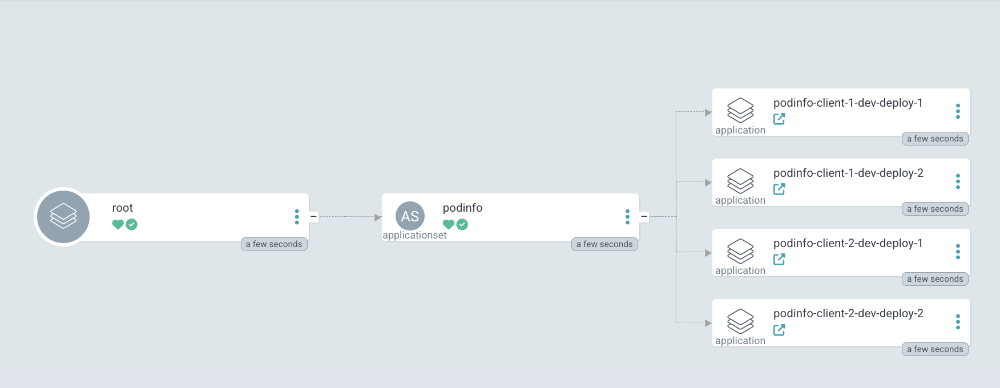
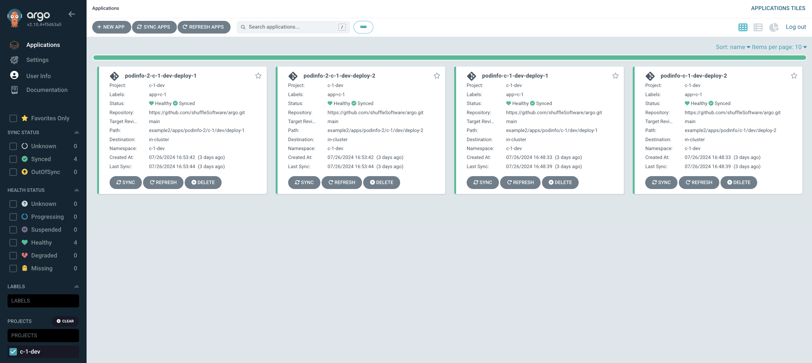

# argo
### example-1

There is a main application to deploys other applications through an appset
</img>
```
helm upgrade -i root -n argocd ./root --dry-run
```


### example-2
There is no 'main' visible app, an appset controls deploying applications
</img>
```
helm upgrade -i root -n argocd ./example-2/root --dry-run
```
